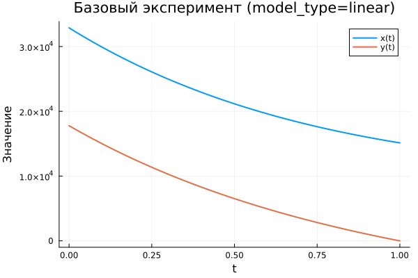

---
## Author
author:
  name: Виктория Симонова
  email: 1132236012@rudn.ru
  affiliation:
    - name: Российский университет дружбы народов
      country: Российская Федерация
      postal-code: 117198
      city: Москва
      address: ул. Миклухо-Маклая, д. 6

## Title
title: "Математическое моделирование"
subtitle: "Лабораторная работа № 3"
license: "CC BY"
date: today
date-format: "YYYY-MM-DD"
---

# Вводная часть

## Цель работы

Исследовать модели Ланчестера, описывающие боевые действия, и проанализировать, как меняется численность войск в различных вариантах вооружённого противостояния.

## Задание

1. Рассмотреть три типа моделей Ланчестера.
2. Построить графики изменения численности армий.
3. Проанализировать характер изменения решений и определить победившую сторону.

# Теория: модели боевых действий

## Основная идея моделей Ланчестера

В конфликте участвуют две стороны, численности которых задаются функциями

$$
x(t), \quad y(t)
$$

Если в некоторый момент одна из функций обращается в нуль, то соответствующая сторона считается проигравшей.

## Случай 1: регулярные войска против регулярных войск

Математическая модель имеет вид

$$
\begin{cases}
\frac{dx}{dt}= -a(t)x(t) - b(t)y(t) + P(t) \\
\frac{dy}{dt}= -c(t)x(t) - h(t)y(t) + Q(t)
\end{cases}
$$

В данной системе учитываются:

- потери, не связанные напрямую с боем;
- боевые потери;
- поступление подкреплений.

## Случай 2: регулярные войска против партизан

В этой модели изменение численности партизан зависит как от сил противника, так и от собственной численности:

$$
\begin{cases}
\frac{dx}{dt}= -a(t)x(t) - b(t)y(t) + P(t) \\
\frac{dy}{dt}= -c(t)x(t)y(t) - h(t)y(t) + Q(t)
\end{cases}
$$

## Случай 3: партизаны против партизан

Для противостояния двух нерегулярных формирований система записывается следующим образом:

$$
\begin{cases}
\frac{dx}{dt}= -a(t)x(t) - b(t)x(t)y(t) + P(t) \\
\frac{dy}{dt}= -h(t)y(t) - c(t)x(t)y(t) + Q(t)
\end{cases}
$$

# Упрощённые модели

## Жёсткая модель для регулярных армий

Если пренебречь подкреплениями и небоевыми потерями, получаем систему

$$
\begin{cases}
\frac{dx}{dt}= -by \\
\frac{dy}{dt}= -ax
\end{cases}
$$

Для такой модели возможно аналитическое решение, а фазовые траектории представляют собой гиперболы.

## Качественный вывод

Исход конфликта определяется не только начальными размерами армий, но и боевой эффективностью сторон.

Из анализа этой модели следует:

- численное превосходство даёт заметное преимущество;
- для компенсации большей численности противника требуется значительно более высокая эффективность вооружения и ведения боя.

# Постановка задачи

## Исходные данные

Между странами $X$ и $Y$ рассматривается военное противостояние.

Начальные численности армий равны

$$
x(0)=32888, \qquad y(0)=17777
$$

Требуется построить графики изменения численности войск для двух моделей.

## Случай 1: линейная модель

$$
\begin{cases}
\frac{dx}{dt}= -0.55x(t) - 0.77y(t) + 1.5\sin(3t+1) \\
\frac{dy}{dt}= -0.66x(t) - 0.44y(t) + 1.2\cos(t+1)
\end{cases}
$$

## Случай 2: нелинейная модель

$$
\begin{cases}
\frac{dx}{dt}= -0.27x(t) - 0.88y(t) + \sin(20t) \\
\frac{dy}{dt}= -0.68x(t)y(t) - 0.37y(t) + \cos(10t)
\end{cases}
$$

# Эксперимент: базовые расчёты

## Базовый эксперимент: линейная модель

## Базовый эксперимент: линейная модель

Основные наблюдения:

- обе переменные убывают с течением времени;
- функция $x(t)$ снижается плавно;
- функция $y(t)$ убывает интенсивнее и к концу интервала почти достигает нуля;
- динамика системы остаётся устойчивой и хорошо предсказуемой.

## Базовый эксперимент: нелинейная модель

## Базовый эксперимент: нелинейная модель

По результатам моделирования видно, что:

- функция $x(t)$ уменьшается медленнее, чем в линейной постановке;
- функция $y(t)$ очень быстро стремится к нулю;
- после этого основную роль в динамике играет переменная $x(t)$;
- нелинейные взаимодействия заметно усиливают затухание.

# Параметрический анализ

## Сканирование траекторий $x(t)$

## Сканирование траекторий $x(t)$

В процессе исследования изменялся один из параметров модели.

Полученные результаты показывают:

- с ростом параметра скорость уменьшения $x(t)$ возрастает;
- траектории становятся более крутыми;
- различия между решениями особенно отчётливо проявляются в середине и в конце временного интервала.

## Сканирование траекторий $y(t)$

## Сканирование траекторий $y(t)$

Анализ позволяет сделать следующие выводы:

- в линейной модели увеличение параметра ускоряет уменьшение $y(t)$;
- в нелинейной модели переменная $y(t)$ почти сразу обращается в нуль независимо от выбранного параметра;
- определяющее влияние оказывают нелинейные члены системы.

# Анализ вычислительных затрат

## Время вычислений

## Время вычислений

Результаты вычислительного эксперимента таковы:

- линейная модель решается быстрее;
- время расчёта линейной системы имеет порядок $10^{-5}$ сек;
- для нелинейной модели время находится в пределах $10^{-4}$–$10^{-3}$ сек;
- даже в более сложном случае вычислительные затраты остаются незначительными.

# Анализ итоговой метрики

## Метрика norm_final

В качестве итоговой характеристики использовалась величина

$$
\text{norm\_final}=\sqrt{x(t_{final})^2 + y(t_{final})^2}
$$

Она характеризует состояние системы в конце интервала моделирования.

## Зависимость norm_final от параметра

## Интерпретация результата

По графику можно сделать вывод, что:

- при увеличении параметра значение метрики уменьшается;
- линейная модель быстрее приближается к состоянию покоя;
- нелинейная модель дольше сохраняет заметную величину состояния;
- это связано с тем, что переменная $x(t)$ в нелинейной постановке затухает медленнее.

# Итоги

## Выводы

1. Линейная модель характеризуется плавным и предсказуемым уменьшением обеих переменных.
2. В нелинейной модели переменная $y(t)$ практически сразу становится близкой к нулю.
3. Параметры системы заметно влияют на скорость затухания решений.
4. В линейной модели это влияние проявляется особенно наглядно.
5. Нелинейная постановка требует больших вычислительных затрат, однако они остаются весьма малыми.
6. Метрика $\text{norm\_final}$ уменьшается при увеличении параметра, что подтверждает усиление затухания динамики.

# Список литературы

1. Законы Осипова — Ланчестера.
2. Дифференциальные уравнения динамики боя.
3. Элементарные модели боя.
