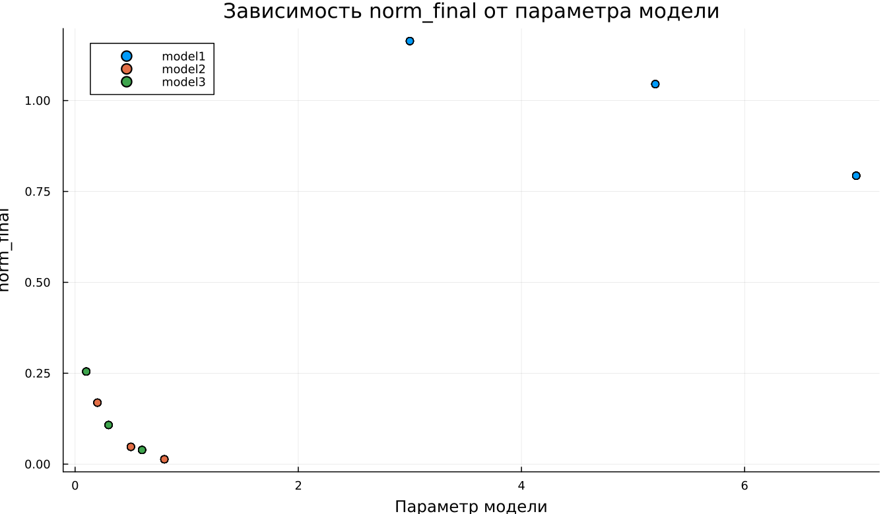

---
## Author
author:
  name: Виктория Симонова
  email: 1132236012@rudn.ru
  affiliation:
    - name: Российский университет дружбы народов
      country: Российская Федерация
      postal-code: 117198
      city: Москва
      address: ул. Миклухо-Маклая, д. 6

## Title
title: "Математическое моделирование"
subtitle: "Лабораторная работа № 4"
license: "CC BY"
---

# Цель работы

Проанализировать свойства и поведение решений уравнения гармонического осциллятора.

# Задание

1. Построить решение уравнения гармонического осциллятора при отсутствии затухания  
2. Записать и исследовать уравнение свободных колебаний с учётом затухания, включая фазовый портрет  
3. Рассмотреть систему под действием внешней силы, построить решение и фазовый портрет  

# Выполнение лабораторной работы

## Теоретические сведения

Разнообразные физические процессы — движение массы на пружине, колебания маятника или поведение электрических цепей — в ряде приближений сводятся к единой математической модели. Эта модель описывается дифференциальным уравнением гармонического осциллятора.

Общее уравнение свободных колебаний имеет вид:

$$
\ddot{x} + 2\gamma \dot{x} + \omega_0^2 x = 0
$$

где $x$ характеризует состояние системы, $\gamma$ отражает уровень диссипации энергии, а $\omega_0$ — собственную частоту.

При отсутствии потерь энергии ($\gamma = 0$) уравнение упрощается:

$$
\ddot{x} + \omega_0^2 x = 0
$$

Для однозначного решения необходимо задать начальные условия:

$$
\begin{cases}
x(t_0) = x_0 \\
\dot{x}(t_0) = y_0
\end{cases}
$$

Введя новую переменную $y = \dot{x}$, получаем систему первого порядка:

$$
\begin{cases}
\dot{x} = y \\
\dot{y} = -\omega_0^2 x
\end{cases}
$$

Начальные условия принимают вид:

$$
\begin{cases}
x(t_0) = x_0 \\
y(t_0) = y_0
\end{cases}
$$

Переменные $x$ и $y$ задают фазовое пространство системы. Каждому решению соответствует траектория на фазовой плоскости. Совокупность таких траекторий формирует фазовый портрет, отражающий общую динамику системы.

## Задача

Необходимо исследовать три варианта системы:

1. Без затухания и внешнего воздействия:
$$
\ddot{x} + 5.2x = 0
$$

2. С затуханием:
$$
\ddot{x} + 14\dot{x} + 0.5x = 0
$$

3. С затуханием и внешней силой:
$$
\ddot{x} + 13\dot{x} + 0.3x = 0.8\sin(9t)
$$

Параметры моделирования:  
$t \in [0;59]$, шаг $0.05$, $x_0 = 0.5$, $y_0 = -1.5$

### Преобразование моделей

1. Без затухания:
$$
\begin{cases}
\dot{x} = y \\
\dot{y} = -\omega_0^2 x
\end{cases}
$$

2. С затуханием:
$$
\begin{cases}
\dot{x} = y \\
\dot{y} = -2\gamma y - \omega_0^2 x
\end{cases}
$$

3. С внешней силой:
$$
\begin{cases}
\dot{x} = y \\
\dot{y} = F(t) - 2\gamma y - \omega_0^2 x
\end{cases}
$$

Для численного моделирования использовались отдельные программные модули:





## Базовые эксперименты

### Первая модель (model_type = model1)

График $y(t)$ демонстрирует устойчивые периодические колебания без уменьшения амплитуды. Форма сигнала остаётся неизменной во времени.

Такое поведение характерно для консервативной системы, в которой отсутствуют потери энергии. Движение сохраняет регулярность и не затухает.

Фазовый портрет представлен замкнутой траекторией, что указывает на периодичность движения и устойчивость режима.

Следовательно, модель описывает идеализированные незатухающие колебания.

### Вторая модель (model_type = model2)

На графике $y(t)$ видно быстрое снижение амплитуды. Уже на начальном участке система практически достигает состояния покоя.

Причиной является наличие демпфирующего слагаемого, вызывающего рассеяние энергии.

Фазовая траектория стремится к точке равновесия, что подтверждает затухающий характер процесса.

Таким образом, система демонстрирует апериодическое затухание и стабилизацию.

### Третья модель (model_type = model3)

В начальный момент наблюдается переходный процесс, после которого устанавливаются колебания малой амплитуды.

Несмотря на наличие затухания, внешняя сила $F(t)$ поддерживает движение системы.

Фазовый портрет принимает форму ограниченной области вблизи равновесия, что соответствует установившемуся режиму.

Итак, система переходит к вынужденным колебаниям.

## Параметрическое сканирование

### Траектории $x(t)$ для различных параметров

Проведено исследование влияния параметров $w_1$, $w_2$, $w_3$.

- в первой модели параметр изменяет частоту колебаний  
- во второй — влияет на скорость затухания  
- в третьей — определяет параметры установившегося режима  

Основные выводы:

- первая система остаётся колебательной  
- вторая стремится к равновесию  
- третья демонстрирует устойчивые вынужденные колебания  

### Траектории $y(t)$ для различных параметров

Поведение $y(t)$ согласуется с предыдущими наблюдениями:

- отсутствие затухания в первой модели  
- быстрое подавление колебаний во второй  
- устойчивые вынужденные колебания в третьей  

## Время вычислений

Анализ показал:

- минимальное время у первой модели  
- умеренное — у второй  
- максимальное — у третьей  

Во всех случаях вычисления выполняются быстро.

## Анализ метрики norm_final

Рассматривается величина:

$$
\text{norm\_final} = \sqrt{x(t_{final})^2 + y(t_{final})^2}
$$

Полученные результаты:

- в первой модели значение остаётся значительным  
- во второй стремится к нулю  
- в третьей принимает малое, но ненулевое значение  

# Выводы

1. Первая модель описывает незатухающие колебания  
2. Вторая демонстрирует быстрое затухание  
3. Третья приводит к установившимся вынужденным колебаниям  
4. Параметры определяют частоту, амплитуду и характер переходных процессов  
5. Все модели эффективно решаются численно  
6. Метрика $\text{norm\_final}$ отражает различия в динамике систем  

# Список литературы {.unnumbered}

1. [Гармонический осциллятор](https://ru.wikipedia.org/wiki/Гармонический_осциллятор)
2. [Модели колебательных систем](https://www.numamo.org/HTML/Articles/Oscillator.html)
