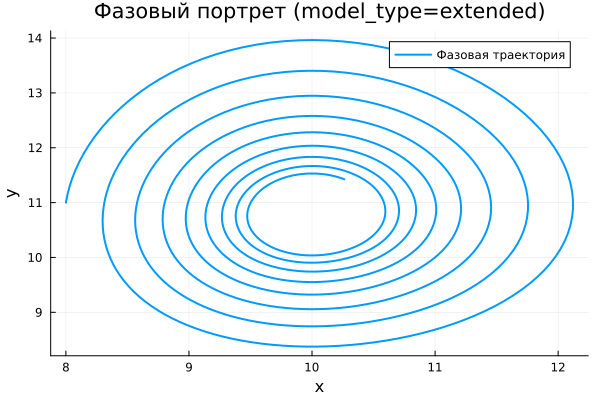

---
## Author
author:
  name: Виктория Симонова
  email: 1132236012@rudn.ru
  affiliation:
    - name: Российский университет дружбы народов
      country: Российская Федерация
      postal-code: 117198
      city: Москва
      address: ул. Миклухо-Маклая, д. 6

## Title
title: "Математическое моделирование"
subtitle: "Лабораторная работа № 5"
license: "CC BY"
---

# Цель работы

Исследовать динамику модели типа «хищник–жертва» и проанализировать её поведение.

# Задание

1. Построить фазовую зависимость $x(y)$, а также временные графики $x(t)$ и $y(t)$  
2. Определить стационарное состояние системы  

# Выполнение лабораторной работы

## Теоретические сведения

В рамках данной работы рассматривается классическая математическая модель взаимодействия двух популяций — хищников и жертв.

Пусть $X$ — численность хищников, $Y$ — численность жертв. Рассматривается система при следующих допущениях (модель Лотки–Вольтерры):

1. Численности популяций зависят исключительно от времени (пространственная структура не учитывается)  
2. При отсутствии взаимодействия каждая популяция развивается по экспоненциальному закону (жертвы растут, хищники убывают)  
3. Естественная смертность жертв и естественное размножение хищников не играют существенной роли  
4. Ограничения на рост численности отсутствуют  
5. Взаимодействие приводит к уменьшению численности жертв пропорционально числу хищников  

Математически модель описывается системой:

$$
\begin{cases}
\frac{dx}{dt} = -a x(t) + b x(t) y(t) \\
\frac{dy}{dt} = c y(t) - d x(t) y(t)
\end{cases}
$$

Здесь параметры имеют следующий смысл:  
$a$ — коэффициент убывания хищников,  
$b$ — коэффициент роста хищников за счёт питания,  
$c$ — коэффициент роста жертв,  
$d$ — коэффициент убыли жертв.

Особое значение имеет равновесное состояние, при котором система перестаёт изменяться:

$$
\frac{dx}{dt} = 0, \quad \frac{dy}{dt} = 0
$$

При условиях $x > 0$, $y > 0$ стационарная точка определяется как:

$$
x_0 = \frac{a}{b}, \quad y_0 = \frac{c}{d}
$$

## Задача

Рассматривается система:

$$
\begin{cases}
\frac{dx}{dt} = -0.25 x(t) + 0.025 x(t) y(t) \\
\frac{dy}{dt} = 0.45 y(t) - 0.045 x(t) y(t)
\end{cases}
$$

Требуется построить графики $x(t)$, $y(t)$ и фазовую траекторию при начальных условиях  
$x_0 = 8$, $y_0 = 11$, а также определить стационарную точку.

Стационарное состояние:

$$
x_0 = \frac{a}{b} = 10, \quad y_0 = \frac{c}{d} = 10
$$

Для численного моделирования использовались внешние программные модули:





## Базовые эксперименты

### Базовая модель (model_type = base)

Анализ временных зависимостей показывает, что система демонстрирует регулярные колебания. Значения $x(t)$ и $y(t)$ изменяются периодически, причём амплитуда практически не изменяется со временем.

Это свидетельствует о наличии устойчивого колебательного режима без затухания. Система не стремится к равновесию, а сохраняет циклическое поведение.

Фазовый портрет представляет собой замкнутую траекторию, что подтверждает повторяемость динамики и ограниченность фазового пространства.

### Расширенная модель (model_type = extended)

В усложнённой модели характер динамики изменяется. В начале наблюдаются значительные колебания, однако их амплитуда постепенно уменьшается.

Причиной служит дополнительный член $-k x^2$, ограничивающий рост популяции жертв. В результате система теряет консервативность и переходит к затухающим колебаниям.

Фазовый портрет имеет вид спирали, сходящейся к внутренней точке, что указывает на устойчивое равновесие.

Таким образом, система со временем стабилизируется и достигает стационарного режима.

## Параметрическое сканирование

### Траектории $x(t)$ для различных параметров

В ходе исследования варьировались параметры: $a$ — для базовой модели и $k$ — для расширенной.

В базовом случае изменение $a$ влияет на форму колебаний (амплитуду и частоту), но не устраняет их периодичность.

В расширенной модели увеличение $k$ ускоряет затухание и приводит к более быстрому выходу на устойчивое состояние.

Основные выводы:

- базовая модель сохраняет периодический режим;
- расширенная модель демонстрирует стабилизацию;
- параметры управляют динамическими характеристиками системы.

### Траектории $y(t)$ для различных параметров

Поведение переменной $y(t)$ аналогично:  
в базовой модели сохраняется устойчивый цикл,  
в расширенной — наблюдается затухание и переход к стационарному уровню.

Чем больше значение параметра $k$, тем быстрее система стабилизируется.

### Фазовые траектории для различных параметров

Фазовые траектории демонстрируют принципиальные различия моделей.

Для базовой системы характерны замкнутые орбиты, что указывает на отсутствие притягивающего равновесия.

Для расширенной модели траектории сходятся к одной точке, формируя спиральную структуру, что свидетельствует о наличии устойчивого состояния.

## Анализ метрики norm_final

Рассматривалась величина:

$$
\text{norm\_final} = \sqrt{x(t_{final})^2 + y(t_{final})^2}
$$

В базовой модели значение метрики остаётся значительным и зависит от параметра $a$, поскольку система продолжает колебаться.

В расширенной модели метрика отражает положение точки равновесия, так как система стремится к устойчивому состоянию.

## Время вычислений

Численные эксперименты показывают, что время расчёта остаётся малым и практически не зависит от параметров.

Незначительные изменения наблюдаются при варьировании $a$ и $k$, однако они несущественны.

Добавление нелинейного члена не приводит к заметному увеличению вычислительных затрат.

## Выводы

1. Базовая модель характеризуется незатухающими колебаниями.  
2. Расширенная модель приводит к стабилизации системы.  
3. Фазовые портреты подтверждают различие типов динамики.  
4. Параметры $a$ и $k$ определяют свойства колебаний.  
5. Метрика $\text{norm\_final}$ отражает режим поведения системы.  
6. Оба варианта модели эффективно решаются численно.  

# Список литературы {.unnumbered}

1. [Модель Лотки-Вольтерры](https://math-it.petrsu.ru/users/semenova/MathECO/Lections/Lotka_Volterra.pdf)  
2. [Lotka-Volterra System](https://www.sciencedirect.com/topics/mathematics/lotka-volterra-system)  
