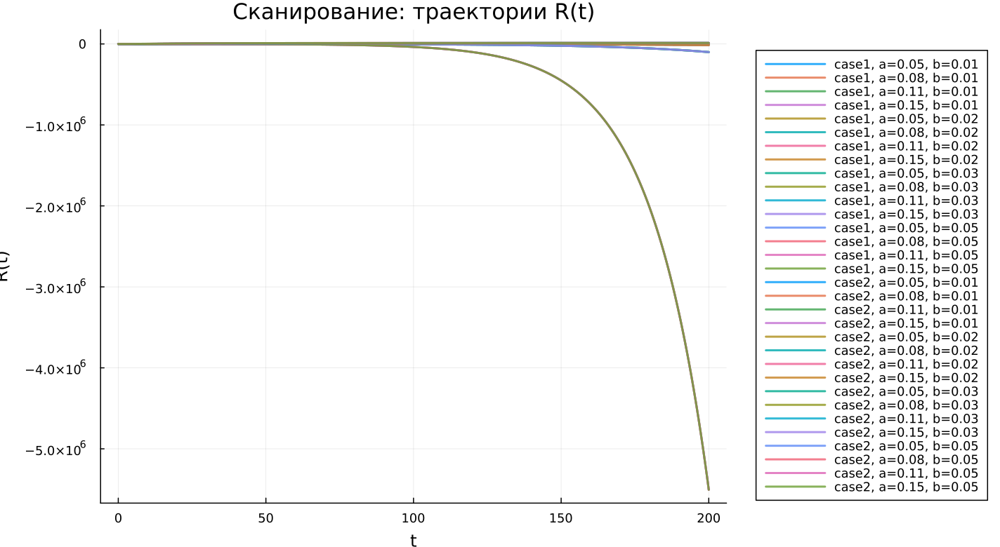
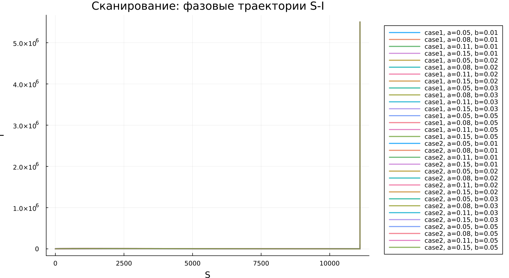

---
## Author
author:
  name: Виктория Симонова
  email: 1132236012@rudn.ru
  affiliation:
    - name: Российский университет дружбы народов
      country: Российская Федерация
      postal-code: 117198
      city: Москва
      address: ул. Миклухо-Маклая, д. 6

## Title
title: "Математическое моделирование"
subtitle: "Лабораторная работа № 6"
license: "CC BY"
---

# Цель работы

Исследовать эпидемиологическую модель $SIR$ и особенности её поведения при различных начальных условиях.

# Задание

1. Изучить математическую модель распространения эпидемии.
2. Построить графики изменения численности особей в каждой из трёх групп. Проанализировать развитие эпидемии для случаев: $I(0)\leq I^*$ и $I(0)>I^*$.

# Выполнение лабораторной работы

## Теоретические сведения

Рассмотрим простейшую модель распространения эпидемии. Пусть имеется изолированная популяция численностью $N$. Все особи этой популяции делятся на три группы. К первой группе относятся восприимчивые к заболеванию, но ещё здоровые особи. Их количество обозначается через $S(t)$. Вторая группа включает инфицированных особей, которые являются источниками распространения инфекции. Их численность обозначим $I(t)$. Третья группа описывает особей, уже перенёсших заболевание и получивших иммунитет. Для неё используется обозначение $R(t)$.

До тех пор пока число инфицированных не превышает критическое значение $I^*$, будем считать, что заболевшие изолированы и не передают инфекцию здоровым. Если же выполняется условие $I(t)>I^*$, то инфицированные начинают заражать восприимчивых особей.

В этом случае скорость изменения числа восприимчивых особей задаётся следующим образом:

$$
\frac{dS}{dt}=
 \begin{cases}
	-\alpha S &\text{, если $I(t) > I^*$}
	\\   
	0 &\text{, если $I(t) \leq I^*$}
 \end{cases}
$$

Так как каждая восприимчивая особь после заражения переходит в группу инфицированных, скорость изменения $I(t)$ определяется разностью между числом новых заражений и числом больных, переходящих к лечению и выздоровлению:

$$
\frac{dI}{dt}=
 \begin{cases}
	\alpha S -\beta I &\text{, если $I(t) > I^*$}
	\\   
	-\beta I &\text{, если $I(t) \leq I^*$}
 \end{cases}
$$

Численность выздоровевших особей, получивших иммунитет, изменяется по закону:

$$
\frac{dR}{dt} = \beta I
$$

Здесь $\alpha$ и $\beta$ являются коэффициентами заболеваемости и выздоровления соответственно. Чтобы решение системы было определено однозначно, необходимо задать начальные условия. Будем считать, что в начальный момент времени $t=0$ число особей с иммунитетом задано как $R(0)$, а начальные значения инфицированных и восприимчивых равны $I(0)$ и $S(0)$. Для анализа динамики эпидемии необходимо рассмотреть два варианта: $I(0) \leq I^*$ и $I(0)>I^*$.

### Задача

На некотором острове началась эпидемия. Известно, что общая численность населения острова составляет $N=11400$. В момент начала эпидемии, то есть при $t=0$, число заболевших людей, способных распространять инфекцию, равно $I(0)=250$. Число здоровых людей, уже имеющих иммунитет к болезни, составляет $R(0)=47$. Тогда количество восприимчивых к заболеванию, но пока здоровых людей в начальный момент времени определяется выражением $S(0)=N-I(0)-R(0)$.

Необходимо построить графики изменения численности каждой из трёх групп.

Следует рассмотреть развитие эпидемии в двух случаях:

1. $I(0)\leq I^*$
2. $I(0)>I^*$

Для моделирования процесса и построения графиков использовались внешние файлы с программным кодом:





## Базовые эксперименты

### Первая модель (model_type = case1)

Для первой модели получена динамика, нехарактерная для классической эпидемиологической системы. Значение $S(t)$ не изменяется во времени, что согласуется с уравнением $dS/dt = 0$. При этом численность инфицированных $I(t)$ быстро возрастает по экспоненциальному закону, а величина $R(t)$ уменьшается и переходит в область отрицательных значений.

Такой результат нельзя считать физически корректным для описания эпидемии. Он связан со структурой заданной системы уравнений: в ней отсутствует механизм, ограничивающий рост числа инфицированных, а переменная $R(t)$ теряет свой естественный смысл, поскольку количество выздоровевших не может быть отрицательным.

Фазовый портрет подтверждает это наблюдение. Траектория практически превращается в вертикальную линию, так как $S$ остаётся неизменным, а изменение состояния системы происходит только за счёт переменной $I$. Следовательно, фактически система сводится к одномерной динамике.

Таким образом, первая модель описывает неограниченный рост числа инфицированных без выхода на устойчивый режим и не может рассматриваться как адекватное описание распространения заболевания.

### Вторая модель (model_type = case2)

Во второй модели наблюдается поведение, характерное для SIR-системы. Число восприимчивых $S(t)$ постепенно уменьшается, что отражает процесс заражения. Количество инфицированных $I(t)$ сначала увеличивается, затем достигает максимального значения, после чего начинает снижаться и стремится к нулю. Число выбывших $R(t)$, наоборот, монотонно возрастает.

Такая динамика соответствует эпидемическому процессу в популяции конечного размера. На начальном этапе заболевание активно распространяется, однако затем, по мере сокращения числа восприимчивых особей, скорость заражения уменьшается, и эпидемия постепенно затухает.

Фазовый портрет имеет вид незамкнутой кривой. Сначала траектория поднимается вверх, что соответствует росту $I$ при уменьшении $S$, а затем плавно опускается вниз. Это показывает прохождение системы через максимум числа инфицированных и последующее ослабление эпидемического процесса.

В отличие от первой модели, во втором случае система стремится к стационарному состоянию: $I(t) \to 0$, значение $S(t)$ выходит на некоторый остаточный уровень, а $R(t)$ принимает конечное значение.

## Параметрическое сканирование

### Траектории $S(t)$ для различных параметров

Анализ графиков $S(t)$ показывает, что две модели по-разному реагируют на изменение параметров. В первой модели (case1) величина $S(t)$ остаётся постоянной при любых значениях параметров, так как для неё выполняется $dS/dt = 0$. Поэтому изменение коэффициентов не оказывает влияния на динамику восприимчивых особей.

Во второй модели (case2) число восприимчивых убывает. Скорость этого убывания существенно зависит от параметра $a$: чем больше значение $a$, тем быстрее уменьшается $S(t)$. Это соответствует более интенсивному распространению инфекции.

Основные результаты:

- в первой модели $S(t)$ остаётся неизменным;
- во второй модели $S(t)$ уменьшается во времени;
- параметр $a$ задаёт скорость снижения числа восприимчивых.

### Траектории $I(t)$ для различных параметров

В первой модели для всех рассмотренных параметров наблюдается экспоненциальный рост $I(t)$. При увеличении параметра $b$ скорость роста становится значительно выше, что приводит к очень большим значениям числа инфицированных.

Во второй модели поведение имеет иной характер. Число инфицированных сначала возрастает, достигает пика, а затем снижается. Параметр $a$ влияет как на высоту максимума, так и на время его достижения: при больших значениях $a$ пик наступает раньше, после чего спад также происходит быстрее.

Можно выделить следующие особенности:

- первая модель приводит к неограниченному увеличению числа инфицированных;
- вторая модель формирует типичную эпидемическую волну;
- параметры определяют скорость и масштаб распространения инфекции.

### Траектории $R(t)$ для различных параметров

Для первой модели характерно уменьшение $R(t)$, причём с течением времени значения становятся отрицательными и быстро растут по модулю. Это указывает на некорректность модели с точки зрения эпидемиологического смысла.

Во второй модели значение $R(t)$ монотонно увеличивается и постепенно приближается к некоторому предельному уровню. Изменение параметров влияет на скорость накопления выбывших: при более интенсивном заражении процесс перехода в группу $R$ происходит быстрее.

Следовательно:

- первая модель даёт нефизичные значения $R(t)$;
- во второй модели наблюдается накопление переболевших и выздоровевших;
- параметры влияют на скорость выхода $R(t)$ к насыщению.

### Фазовые траектории для различных параметров

Фазовые портреты наглядно показывают принципиальное различие между моделями.

В первой модели все траектории фактически являются вертикальными линиями, поскольку переменная $S$ не изменяется. Это означает, что полноценная двумерная динамика отсутствует.

Во второй модели фазовые траектории представлены характерными кривыми, описывающими эпидемический процесс. Сначала наблюдается рост $I$ при одновременном уменьшении $S$, затем число инфицированных начинает снижаться при дальнейшем уменьшении числа восприимчивых.

Таким образом, изменение параметров не меняет качественный тип поведения моделей:

- первая модель остаётся вырожденной;
- вторая модель сохраняет реалистичную структуру эпидемической динамики.

### Анализ метрики norm_final

Для оценки конечного состояния системы использовалась метрика

$$
\text{norm\_final} = \sqrt{S(t_{final})^2 + I(t_{final})^2 + R(t_{final})^2}.
$$

В первой модели значение $\text{norm\_final}$ быстро увеличивается при росте параметра $b$. Это объясняется экспоненциальным увеличением $I(t)$ и одновременным уходом $R(t)$ в отрицательную область, из-за чего норма принимает большие значения.

Во второй модели значения данной метрики значительно меньше и меняются более плавно. Это связано с тем, что система выходит на стационарное состояние, где $I(t) \to 0$, а $S(t)$ и $R(t)$ остаются конечными.

Итоговые наблюдения:

- в первой модели метрика возрастает без ограничения;
- во второй модели она характеризует конечное устойчивое состояние системы.

### Анализ максимального числа инфицированных

Максимальное число инфицированных $I_{max}$ существенно зависит от выбранных параметров.

В первой модели $I_{max}$ достигает крайне больших значений, что связано с отсутствием механизма, сдерживающего рост инфицированных. При увеличении параметра $b$ максимум резко возрастает.

Во второй модели величина $I_{max}$ остаётся конечной и определяется значением параметра $a$. При увеличении $a$ пик инфицированных достигается быстрее, однако его значение остаётся ограниченным.

Следовательно:

- первая модель демонстрирует неограниченный рост $I_{max}$;
- вторая модель описывает ограниченную и контролируемую эпидемическую волну.

### Время вычислений

Результаты бенчмаркинга показывают, что время численного решения во всех экспериментах остаётся малым и имеет порядок $\sim 10^{-4}$ секунды.

Для обеих моделей изменение параметров почти не влияет на вычислительное время. Небольшие различия связаны с особенностями используемого численного метода и выбором адаптивного шага интегрирования.

На основании этого можно сделать следующие выводы:

- обе модели эффективно решаются численными методами;
- изменение параметров практически не меняет вычислительную сложность;
- даже при экспоненциальном росте решений в case1 время вычисления остаётся небольшим.

## Выводы

1. Первая модель (case1) приводит к неограниченному экспоненциальному росту числа инфицированных при постоянном числе восприимчивых, что указывает на её нефизичный характер и отсутствие стабилизирующего механизма.
2. Вторая модель (case2) воспроизводит типичную эпидемическую динамику: сначала число инфицированных растёт, затем достигает максимума и постепенно уменьшается, а система переходит к стационарному состоянию.
3. Фазовые портреты подтверждают качественное различие моделей: в первой модели траектория вырождается в вертикальную линию, во второй формируется полноценная кривая, отражающая ход эпидемии.
4. Параметры $a$ и $b$ заметно влияют на поведение системы: $a$ определяет скорость уменьшения числа восприимчивых, а $b$ влияет на интенсивность изменения числа инфицированных.
5. Метрика $\text{norm\_final}$ позволяет количественно различить модели: в первой модели она неограниченно возрастает, а во второй стабилизируется и описывает конечное состояние системы.
6. Максимальное число инфицированных $I_{max}$ в первой модели растёт без ограничения, тогда как во второй модели остаётся конечным и зависит от параметров.
7. Численное решение обеих моделей выполняется быстро, а изменение параметров практически не оказывает влияния на время вычислений.

# Список литературы {.unnumbered}

1. [Конструирование эпидемиологических моделей](https://habr.com/ru/post/551682/)
2. [Зараза, гостья наша](https://nplus1.ru/material/2019/12/26/epidemic-math)
