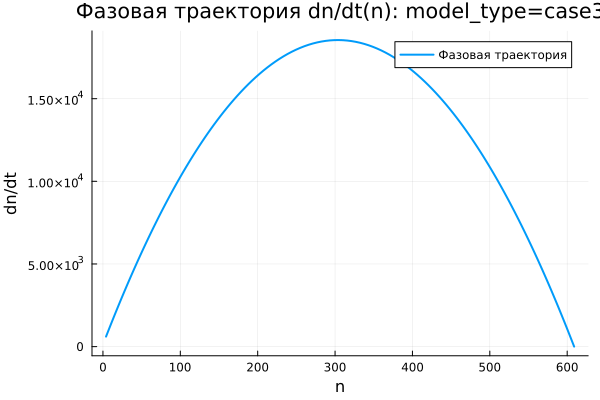

---
author:
  name: Виктория Симонова
  email: 1132236012@rudn.ru
  affiliation:
    - name: Российский университет дружбы народов
      country: Российская Федерация
      city: Москва
title: "Математическое моделирование"
subtitle: "Лабораторная работа №7"
license: "CC BY"
date: today
date-format: "YYYY-MM-DD"
---

# Вводная часть

## Цель работы

Изучить модель эффективности рекламной кампании и проанализировать процесс распространения информации о товаре среди потенциальных покупателей.

## Задание

1. Рассмотреть математическую модель эффективности рекламы.
2. Построить графики распространения рекламы для трёх вариантов модели.
3. Исследовать изменение скорости распространения информации.
4. Провести параметрическое исследование.
5. Сравнить динамику трёх моделей.

# Теоретические сведения

## Модель распространения рекламы

В модели используются следующие обозначения:

- $N$ — общее число потенциальных покупателей;
- $n(t)$ — число покупателей, которые знают о товаре к моменту времени $t$;
- $t$ — время, прошедшее с начала рекламной кампании;
- $\frac{dn}{dt}$ — скорость распространения информации о товаре.

## Основная идея модели

Информация о товаре распространяется двумя основными путями:

1. Через прямое воздействие рекламной кампании.
2. Через общение покупателей друг с другом.

Общий вид модели задаётся уравнением:

$$
\frac{dn}{dt} =
(\alpha_1(t) + \alpha_2(t)n(t))(N - n(t)).
$$

## Смысл множителя насыщения

Множитель $(N - n(t))$ показывает количество покупателей, которые ещё не получили информацию о товаре.

Когда $n(t)$ приближается к $N$, выполняется соотношение:

$$
N - n(t) \rightarrow 0.
$$

Из-за этого скорость распространения рекламы постепенно уменьшается.

## Уровень насыщения

Величина $N$ задаёт предельный уровень охвата аудитории:

$$
n(t) \rightarrow N.
$$

При $n = N$ все потенциальные покупатели уже знают о товаре, поэтому дальнейшее увеличение $n(t)$ прекращается.

# Постановка задачи

## Исходные данные

Заданы параметры:

$$
N = 609,
$$

$$
n(0) = 4.
$$

Требуется построить графики $n(t)$ для трёх моделей распространения рекламы и проанализировать полученные результаты.

## Первая модель

$$
\frac{dn}{dt} =
(0.54 + 0.00016n(t))(N - n(t)).
$$

В первой модели прямое рекламное воздействие играет более заметную роль, чем распространение информации через общение покупателей.

## Вторая модель

$$
\frac{dn}{dt} =
(0.000021 + 0.38n(t))(N - n(t)).
$$

Во второй модели основной вклад в рост даёт взаимодействие между информированными и неинформированными покупателями.

## Третья модель

$$
\frac{dn}{dt} =
(0.2\cos t + 0.2\cos 2t \cdot n(t))(N - n(t)).
$$

В третьей модели коэффициенты зависят от времени, поэтому интенсивность распространения информации меняется в процессе моделирования.

# Базовые эксперименты

## Первая модель: динамика $n(t)$

## Первая модель: скорость изменения

## Первая модель: фазовая траектория

## Анализ первой модели

Для первой модели функция $n(t)$ возрастает монотонно.

Ключевые особенности процесса:

- значение $n(t)$ постепенно приближается к уровню $N = 609$;
- наибольший прирост наблюдается в начале моделирования;
- затем скорость распространения информации снижается;
- решение не превышает уровень насыщения.

## Вывод по первой модели

Первая модель описывает насыщаемый рост.

При приближении $n(t)$ к $N$ множитель $(N - n)$ уменьшается, поэтому выполняется:

$$
\frac{dn}{dt} \rightarrow 0.
$$

Состояние $n = N$ является равновесным, поскольку правая часть уравнения обращается в ноль.

# Вторая модель

## Вторая модель: динамика $n(t)$

## Вторая модель: скорость изменения

## Вторая модель: фазовая траектория

## Анализ второй модели

Во второй модели рост $n(t)$ происходит значительно быстрее, чем в первом случае.

График имеет S-образный вид:

- сначала рост остаётся медленным;
- затем скорость резко увеличивается;
- после достижения максимума скорость начинает уменьшаться;
- решение быстро приближается к уровню $N$.

## Максимальная скорость

Во второй модели скорость распространения рекламы имеет выраженный внутренний максимум.

Это объясняется действием двух противоположных факторов:

- множитель $bn$ усиливает распространение информации;
- множитель $(N - n)$ ограничивает дальнейший рост.

Максимальная скорость достигается не в начале процесса, а на промежуточном участке, когда число информированных покупателей уже достаточно велико, но запас до насыщения ещё сохраняется.

# Третья модель

## Третья модель: динамика $n(t)$

## Третья модель: скорость изменения

## Третья модель: фазовая траектория

## Анализ третьей модели

Третья модель также приводит систему к насыщению.

Её особенность состоит в наличии временных множителей:

$$
\cos t,\quad \cos 2t.
$$

На выбранном коротком интервале значения этих функций остаются положительными. Поэтому решение не переходит к колебательному режиму, а продолжает монотонно возрастать.

## Вывод по третьей модели

Третья модель описывает насыщаемый рост с коэффициентами, зависящими от времени.

Несмотря на наличие тригонометрических функций, общий характер процесса сохраняется:

$$
n(t) \rightarrow N.
$$

После приближения к уровню насыщения скорость изменения становится близкой к нулю.

# Сравнение базовых моделей

## Качественное различие

| Характеристика | case1 | case2 | case3 |
|---|---|---|---|
| Вид роста | монотонный | S-образный | S-образный |
| Скорость в начале | максимальная | малая | малая |
| Максимум $\frac{dn}{dt}$ | в начале | внутри интервала | внутри интервала |
| Предельное значение | $N$ | $N$ | $N$ |
| Коэффициенты | постоянные | постоянные | зависят от времени |

## Общая особенность

Во всех трёх моделях присутствует множитель:

$$
N - n(t).
$$

Он отвечает за насыщение и не позволяет числу информированных покупателей расти неограниченно.

# Параметрическое исследование

## Зависимость $n_{final}$ от параметра $a$

## Анализ зависимости $n_{final}(a)$

Большинство точек расположено около уровня $N = 609$.

Это означает, что при большей части наборов параметров система успевает приблизиться к насыщению за выбранное время моделирования.

Заметное отклонение наблюдается во второй модели при малом значении параметра $a$. В этом случае рост оказывается недостаточно быстрым, поэтому итоговое значение $n_{final}$ остаётся ниже предельного уровня.

## Зависимость $n_{final}$ от параметра $b$

## Анализ зависимости $n_{final}(b)$

Параметр $b$ определяет вклад распространения информации через общение покупателей.

При увеличении $b$ влияние уже информированных покупателей усиливается, поэтому процесс распространения рекламы ускоряется.

Если значение $b$ недостаточно велико, система может не успеть достичь насыщения за заданный интервал времени.

# Максимальные значения

## Зависимость $n_{max}$ от параметра $a$

## Зависимость $n_{max}$ от параметра $b$

## Анализ $n_{max}$

В базовых экспериментах решения возрастают монотонно, поэтому величина $n_{max}$ почти совпадает с $n_{final}$.

Если модель достигает насыщения, то выполняется приближённое равенство:

$$
n_{max} \approx N.
$$

Если расчётный интервал слишком короткий, значение $n_{max}$ остаётся ниже $N$.

# Финальное насыщение

## Зависимость насыщения от параметра $a$

## Зависимость насыщения от параметра $b$

## Метрика насыщения

Для оценки степени достижения предельного уровня использовалась метрика:

$$
\text{saturation\_final} =
\frac{n_{final}}{N}.
$$

Если её значение близко к $1$, система почти полностью вышла на уровень насыщения.

## Интерпретация насыщения

Для большинства экспериментов выполняется:

$$
\frac{n_{final}}{N} \approx 1.
$$

Это соответствует почти полному охвату потенциальной аудитории.

Пониженные значения показывают, что переходный процесс ещё не завершился к концу расчётного интервала.

# Бенчмаркинг

## Время решения от параметра $a$

## Время решения от параметра $b$

## Анализ времени вычислений

Бенчмаркинг показал следующие результаты:

- все три модели решаются за малое время;
- время вычислений имеет порядок $10^{-5}$ секунды;
- изменение параметров $a$ и $b$ почти не увеличивает вычислительные затраты;
- третья модель немного сложнее из-за вычисления функций $\cos t$ и $\cos 2t$.

# Итоги

## Основные результаты

1. Все три модели описывают насыщаемый рост.
2. Предельным уровнем охвата является $N = 609$.
3. В первой модели максимальная скорость наблюдается в начальный момент.
4. Вторая модель демонстрирует наиболее резкий S-образный рост.
5. Третья модель учитывает временную зависимость коэффициентов.
6. Во всех случаях насыщение возникает из-за множителя $(N - n)$.

## Выводы

1. Первая модель (case1) описывает монотонное приближение $n(t)$ к уровню $N$.

2. Вторая модель (case2) имеет S-образную динамику и внутренний максимум скорости распространения рекламы.

3. Третья модель (case3) также приводит к насыщению, но использует коэффициенты, зависящие от времени.

4. Параметры $a$ и $b$ влияют главным образом на скорость выхода к насыщению.

5. Метрики $n_{final}$, $n_{max}$ и $\text{saturation\_final}$ позволяют количественно сравнить результаты моделирования.

6. Численное решение всех трёх моделей выполняется эффективно и не требует значительных вычислительных ресурсов.

7. Модели различаются скоростью перехода к предельному состоянию и характером изменения производной $\frac{dn}{dt}$.

# Список литературы {.unnumbered}

1. [Модель Мальтуса](http://km.mmf.bsu.by/courses/2018/mathmod1/MM_LB1_Population_2019.pdf)
2. [Логистическая модель роста](https://studopedia.ru/29_5129_logisticheskaya-model-rosta.html)
