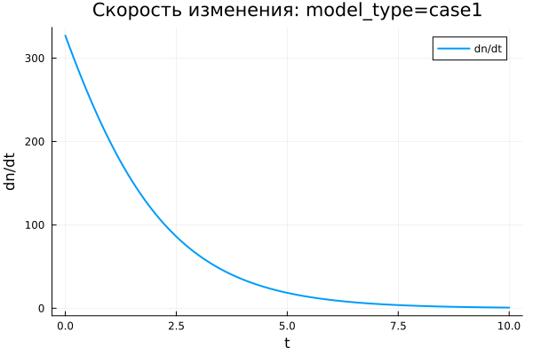

---
## Author
author:
  name: Виктория Симонова
  email: 1132236012@rudn.ru
  affiliation:
    - name: Российский университет дружбы народов
      country: Российская Федерация
      postal-code: 117198
      city: Москва
      address: ул. Миклухо-Маклая, д. 6

## Title
title: "Математическое моделирование"
subtitle: "Лабораторная работа № 7"
license: "CC BY"
---

# Цель работы

Рассмотреть математическую модель эффективности рекламной кампании и исследовать динамику распространения информации о товаре среди потенциальных покупателей.

# Задание

1. Изучить модель эффективности рекламы.
2. Построить графики распространения рекламы для заданных вариантов модели.
3. Для второго варианта определить момент времени, при котором скорость распространения рекламы достигает максимума.

# Выполнение лабораторной работы

## Теоретические сведения

Рассмотрим рекламную кампанию, направленную на продвижение нового товара или услуги. При её планировании важно, чтобы ожидаемая прибыль от будущих продаж превысила затраты на рекламу. На начальном этапе расходы могут быть больше дохода, поскольку о продукте знает лишь небольшая часть потенциальных покупателей. Далее, по мере роста информированности аудитории, увеличивается количество продаж и возрастает прибыль. После насыщения рынка дальнейшая реклама теряет эффективность, поскольку почти все заинтересованные покупатели уже знают о товаре.

Пусть торговые организации реализуют некоторую продукцию. В момент времени $t$ из общего числа потенциальных покупателей $N$ о товаре известно только $n$ покупателям. Для ускорения продаж запускается рекламная кампания через радио, телевидение и другие средства массовой информации. После начала кампании сведения о продукции распространяются не только за счёт рекламы, но и через общение покупателей между собой. Поэтому скорость изменения количества информированных потребителей зависит как от числа уже осведомлённых людей, так и от числа покупателей, ещё не получивших информацию о товаре.

Модель рекламной кампании задаётся следующими величинами:

- $\frac{dn}{dt}$ — скорость изменения количества потребителей, которые узнали о товаре и потенциально готовы его приобрести;
- $t$ — время, прошедшее с момента запуска рекламной кампании;
- $N$ — общее число потенциальных платежеспособных покупателей;
- $n(t)$ — число покупателей, уже получивших информацию о товаре.

Вклад прямой рекламы пропорционален числу покупателей, ещё не знающих о товаре, и описывается выражением $a_1(t)(N - n(t))$, где $a_1(t) > 0$ характеризует интенсивность рекламной кампании и зависит от текущих затрат на продвижение.

Кроме прямого воздействия рекламы, информацию распространяют сами потребители, уже узнавшие о товаре. Этот механизм соответствует эффекту «сарафанного радио» и задаётся величиной $a_2(t)n(t)(N - n(t))$. При росте числа информированных покупателей данный вклад усиливается.

В результате математическая модель распространения рекламы имеет вид:

$$
\frac{dn}{dt} = (a_1(t) + a_2(t)n(t))(N - n(t))
$$

Если $a_1(t) >> a_2(t)$, модель по характеру близка к модели Мальтуса. Её решение демонстрирует быстрый рост с последующим приближением к предельному уровню.

{ #fig:001 width=70% height=70% }

Если $a_1(t) << a_2(t)$, основную роль начинает играть нелинейное слагаемое, и динамика становится близкой к логистической кривой.

{ #fig:002 width=70% height=70% }

## Задача

Необходимо построить графики распространения рекламы для моделей, заданных следующими дифференциальными уравнениями:

1. $\frac{dn}{dt} = (0.54 + 0.00016n(t))(N - n(t))$
2. $\frac{dn}{dt} = (0.000021 + 0.38n(t))(N - n(t))$
3. $\frac{dn}{dt} = (0.2\cos{t} + 0.2\cos{2t}n(t))(N - n(t))$

Объём потенциальной аудитории равен $N = 609$. В начальный момент времени о товаре знают $4$ человека.

Для второго случая требуется найти момент времени, в который скорость распространения рекламы принимает максимальное значение.

Для моделирования процесса и построения графиков использовались внешние файлы с программным кодом:





## Базовые эксперименты

### Первая модель (model_type = case1)

Для первой модели функция $n(t)$ возрастает монотонно. В начале процесса значение $n$ значительно меньше предельного уровня $N = 609$, поэтому число информированных покупателей увеличивается быстро. Далее, по мере приближения к насыщению, темп роста постепенно снижается.

На графике динамики видно, что к концу рассматриваемого интервала $t \in [0; 10]$ решение почти достигает уровня $N$. Горизонтальная пунктирная линия обозначает предельное значение аудитории, к которому стремится численное решение. При этом $n(t)$ не выходит за верхнюю границу, а приближается к ней снизу.

График скорости изменения показывает, что наибольшее значение $\frac{dn}{dt}$ наблюдается в начальный момент времени. Затем скорость монотонно уменьшается и стремится к нулю. Следовательно, основной прирост числа информированных покупателей происходит в начале рекламной кампании, после чего система переходит к состоянию насыщения.

Фазовая траектория $\frac{dn}{dt}(n)$ подтверждает полученный результат. При малых значениях $n$ скорость изменения максимальна, а при приближении к $N$ она почти обращается в ноль. Траектория имеет убывающий характер, что соответствует процессу с быстрым стартом и дальнейшим замедлением.

Первая модель показывает устойчивое приближение к предельному уровню $N$. Состояние $n = N$ является равновесным, поскольку при достижении насыщения множитель $(N - n)$ обращает правую часть уравнения в ноль.

### Вторая модель (model_type = case2)

Во второй модели рост $n(t)$ происходит значительно быстрее, чем в первом варианте. Интервал расчёта имеет малую длину: $t \in [0; 0{,}04]$, однако за это время решение почти достигает уровня $N = 609$. Быстрый переход к насыщению связан с большим значением коэффициента $b$, который усиливает влияние нелинейного слагаемого $bn$.

График $n(t)$ имеет выраженную S-образную форму. В начале рост остаётся сравнительно слабым, поскольку число информированных покупателей ещё мало. Затем скорость резко увеличивается, а после этого снова уменьшается из-за приближения к предельному уровню $N$. В результате решение быстро выходит к насыщению.

На графике $\frac{dn}{dt}$ присутствует один отчётливый максимум. Сначала скорость растёт, достигает пикового значения в середине активного участка процесса, а затем убывает почти до нуля. Это означает, что модель описывает режим ускоренного распространения информации с последующим торможением из-за ограничивающего множителя $(N - n)$.

Фазовая траектория $\frac{dn}{dt}(n)$ имеет параболический вид. При малых значениях $n$ скорость изменения невелика. Затем она увеличивается и достигает максимума примерно при $n \approx 300$, после чего начинает снижаться при движении к $N$. Данная форма отражает взаимодействие двух факторов: самоускорения через множитель $bn$ и ограничения роста через множитель $(N - n)$.

Во второй модели переход к насыщению выражен резче, чем в первой. Максимальная скорость достигается не в начальный момент времени, а внутри траектории, когда число информированных покупателей уже достаточно велико, но до полного насыщения ещё остаётся существенный запас.

### Третья модель (model_type = case3)

В третьей модели функция $n(t)$ также возрастает монотонно и быстро приближается к уровню $N = 609$. По графику видно, что основная часть роста приходится на начальный участок интервала $t \in [0; 0{,}15]$. После этого кривая почти совпадает с горизонтальным уровнем насыщения.

Отличие третьей модели состоит в наличии периодических множителей $\cos(t)$ и $\cos(2t)$. На выбранном коротком временном интервале данные функции остаются положительными и близкими к единице, поэтому они не формируют колебательный режим, а лишь изменяют интенсивность роста.

График скорости $\frac{dn}{dt}$ содержит один выраженный пик. В начале процесса скорость увеличивается, затем достигает максимума, после чего быстро уменьшается до значений, близких к нулю. После выхода $n(t)$ на уровень насыщения дальнейшие изменения практически прекращаются.

Фазовая траектория $\frac{dn}{dt}(n)$ по форме близка к параболе. Скорость мала при небольшом числе информированных покупателей, затем возрастает и достигает максимума примерно в средней части диапазона. При приближении к $N$ множитель $(N - n)$ снижает скорость почти до нуля.

Третья модель демонстрирует насыщаемый рост с коэффициентами, зависящими от времени. На выбранном интервале периодические множители не меняют общий характер процесса: решение остаётся монотонным, достигает предельного уровня и переходит к равновесному состоянию.

## Сравнение базовых экспериментов

Во всех трёх моделях величина $n(t)$ стремится к одному предельному уровню $N = 609$. Это объясняется наличием множителя $(N - n)$, который уменьшает скорость роста при приближении к насыщению и обращает её в ноль при $n = N$.

Первая модель характеризуется быстрым начальным ростом и последующим плавным замедлением. Максимальная скорость наблюдается в начале процесса, а фазовая траектория имеет убывающий вид.

Вторая модель демонстрирует наиболее резкий S-образный рост. Скорость сначала увеличивается, затем достигает максимума и далее уменьшается. Фазовая траектория имеет выраженную параболическую форму, что указывает на наличие внутренней точки максимального роста.

Третья модель по характеру близка ко второй, однако в ней коэффициенты зависят от времени. На рассматриваемом интервале эта зависимость не приводит к колебаниям, поскольку значения $\cos(t)$ и $\cos(2t)$ остаются положительными.

Все три модели приводят систему к насыщению, но отличаются скоростью выхода к предельному состоянию и поведением производной $\frac{dn}{dt}$.

## Параметрическое сканирование

### Зависимость итогового значения $n$ от параметра $a$

На графике представлена зависимость итогового значения $n_{final}$ от параметра $a$ для трёх моделей. Большая часть точек расположена около уровня $N = 609$, что свидетельствует о почти полном насыщении к концу расчётного интервала.

Для первой модели значения $n_{final}$ остаются близкими к $N$ при всех рассмотренных значениях параметра $a$. Следовательно, изменение $a$ в выбранном диапазоне не нарушает общий характер процесса: решение продолжает приближаться к предельному уровню.

Во второй модели заметен один выброс при малом значении $a$. В этом эксперименте итоговое значение $n$ существенно ниже $N$ и составляет примерно $n_{final} \approx 455$. Это связано с тем, что при данной комбинации параметров процесс не успевает достичь насыщения за короткий интервал моделирования.

Для третьей модели значения $n_{final}$ также находятся в верхней части графика и близки к $N$. Периодические коэффициенты при выбранных параметрах не приводят к заметному снижению итогового уровня.

В целом параметр $a$ влияет не только на конечное значение, но и на скорость выхода к насыщению. При малой интенсивности роста система может не успеть приблизиться к уровню $N$ за заданное время расчёта.

### Зависимость итогового значения $n$ от параметра $b$

График зависимости $n_{final}$ от параметра $b$ показывает, что в большинстве экспериментов итоговое значение также располагается около $N = 609$. Это подтверждает устойчивое стремление решений к насыщению.

Для первой модели точки сгруппированы около малых значений $b$, поскольку при сканировании для данного варианта использовался небольшой диапазон коэффициента. Несмотря на это, итоговые значения $n$ остаются близкими к предельному уровню.

Во второй модели влияние параметра $b$ выражено сильнее. При одном из значений $b$ итоговое значение $n$ заметно ниже уровня насыщения. Это означает, что для соответствующего набора параметров рост оказывается недостаточно быстрым, и система не успевает приблизиться к $N$ за время расчёта.

Для третьей модели точки находятся около $N$, что указывает на сохранение режима насыщаемого роста. Даже при наличии множителей $\cos(t)$ и $\cos(2t)$ итоговое значение остаётся близким к верхнему пределу.

Данный график показывает, что параметр $b$ особенно важен для моделей с нелинейным усилением роста через слагаемое $bn$. При недостаточном значении коэффициента выход к насыщению может замедляться.

### Зависимость максимального значения $n$ от параметра $a$

На графике показана зависимость максимального значения $n_{max}$ от параметра $a$. Поскольку во всех базовых экспериментах функция $n(t)$ возрастает монотонно, величина $n_{max}$ практически совпадает с итоговым значением $n_{final}$.

Для первой модели максимальные значения находятся около уровня $N = 609$. Это означает, что решение достигает верхней границы или подходит к ней очень близко.

Во второй модели снова выделяется точка с меньшим значением $n_{max}$. Это показывает, что за весь временной интервал решение не смогло приблизиться к насыщению. Причина связана не с изменением направления динамики, а с недостаточной скоростью роста на заданном промежутке времени.

Для третьей модели максимальные значения сохраняются около $N$. Следовательно, зависящие от времени коэффициенты не мешают достижению высокого уровня $n$ при выбранном диапазоне параметров.

Поскольку $n_{max}$ отражает наибольшее значение решения за время расчёта, данный график подтверждает выводы, полученные при анализе $n_{final}$.

### Зависимость максимального значения $n$ от параметра $b$

График зависимости $n_{max}$ от параметра $b$ близок по структуре к графику $n_{final}(b)$. Это связано с монотонным ростом решений: максимум достигается в конце расчётного интервала или рядом с ним.

Для первой модели значения $n_{max}$ сосредоточены около $N$. Изменение параметра $b$ в малом диапазоне не вызывает существенного уменьшения максимального уровня.

Во второй модели одна точка располагается заметно ниже остальных. Это означает, что при соответствующей комбинации параметров модель не выходит к насыщению. Остальные эксперименты для второго варианта дают значения около верхнего предела.

Для третьей модели все точки остаются вблизи $N$, что говорит о стабильном достижении насыщения. Параметр $b$ влияет на темп роста, но в выбранных экспериментах не меняет конечный характер динамики.

График подтверждает, что максимальный уровень $n$ прежде всего ограничивается величиной $N$, а параметры $a$ и $b$ определяют скорость приближения к этому пределу.

### Зависимость финального насыщения от параметра $a$

На графике приведена зависимость относительного итогового насыщения $n_{final}/N$ от параметра $a$. Значение, близкое к $1$, соответствует почти полному достижению предельного уровня $N$.

Для первой модели насыщение остаётся около $1$ при всех рассмотренных значениях $a$. Это показывает, что модель устойчиво приходит к предельному состоянию.

Во второй модели наблюдается одна точка с насыщением около $0{,}75$. Это означает, что в данном эксперименте итоговое значение составляет примерно три четверти от максимально возможного уровня. Остальные точки находятся значительно выше и близки к полному насыщению.

Для третьей модели значения $n_{final}/N$ расположены рядом с $1$. Это указывает на почти полный выход к насыщению даже при наличии временной зависимости коэффициентов.

Такой способ представления удобен для сравнения моделей, поскольку нормировка на $N$ позволяет анализировать не абсолютное значение $n$, а степень приближения к верхнему пределу.

### Зависимость финального насыщения от параметра $b$

График зависимости $n_{final}/N$ от параметра $b$ показывает, что большинство экспериментов завершается почти полным насыщением. Значения расположены рядом с $1$, что соответствует достижению уровня $N$.

Для первой модели насыщение остаётся высоким при всех рассмотренных значениях $b$. Даже малые значения параметра не мешают решению приблизиться к предельному уровню за выбранное время.

Во второй модели снова присутствует одно пониженное значение. В этом эксперименте система достигает только около $75\%$ от уровня $N$. Этот результат показывает чувствительность второй модели к сочетанию параметров и длине расчётного интервала.

Для третьей модели точки находятся около полного насыщения. Временные множители не вызывают заметного снижения итогового уровня.

В целом график подтверждает стремление системы к насыщению. Однако при отдельных наборах параметров время моделирования может оказаться недостаточным для выхода на уровень $N$.

## Бенчмаркинг

### Зависимость времени решения ODE от параметра $a$

На графике показано медианное время численного решения задачи ОДУ при различных значениях параметра $a$. Время вычислений находится примерно в диапазоне от $3{,}45 \cdot 10^{-5}$ до $3{,}95 \cdot 10^{-5}$ секунды.

Для всех трёх моделей значения времени близки друг к другу. Это означает, что рассматриваемые задачи имеют низкую вычислительную сложность, а изменение параметров не вызывает резкого увеличения затрат на интегрирование.

Явной монотонной зависимости времени решения от параметра $a$ не наблюдается. Точки имеют небольшой разброс, который может быть связан с особенностями численного метода, кэшированием, текущей системной нагрузкой и погрешностью измерений при малых временах выполнения.

Третья модель в отдельных точках требует немного больше времени. Это можно объяснить более сложной правой частью уравнения, где дополнительно вычисляются функции $\cos(t)$ и $\cos(2t)$.

В целом результаты бенчмаркинга показывают, что все три модели решаются быстро, а различия между ними по времени вычислений остаются незначительными.

### Зависимость времени решения ODE от параметра $b$

На графике представлена зависимость времени решения ОДУ от параметра $b$. Как и для параметра $a$, значения времени находятся в узком диапазоне порядка $10^{-5}$ секунды.

Для первой модели точки сосредоточены около малых значений $b$, что соответствует выбранной сетке параметров. Время решения немного колеблется, но устойчивого роста или убывания не наблюдается.

Для второй модели значения времени также меняются с небольшим разбросом. Даже при увеличении $b$ вычислительные затраты существенно не возрастают. Это говорит о том, что выбранный численный решатель справляется с задачей без заметного усложнения интегрирования.

Для третьей модели часть точек располагается выше, чем у первых двух моделей. Наиболее вероятная причина состоит в более сложной формуле правой части, содержащей тригонометрические множители. При этом различие остаётся небольшим и не меняет общий вывод о высокой скорости расчёта.

График показывает, что параметр $b$ сильнее влияет на динамику решения, чем на время вычислений. В рамках проведённого сканирования вычислительная стоимость остаётся стабильной для всех трёх моделей.

## Выводы

1. Первая модель (case1) описывает насыщаемый рост величины $n(t)$. Решение монотонно увеличивается и постепенно приближается к предельному уровню $N = 609$, не превышая его.

2. Во второй модели (case2) наблюдается самый резкий рост. Функция $n(t)$ имеет выраженную S-образную форму: сначала рост слабый, затем он ускоряется, после чего замедляется при приближении к насыщению.

3. Третья модель (case3) также приводит систему к насыщению, но отличается наличием коэффициентов, зависящих от времени: $\cos(t)$ и $\cos(2t)$. На выбранном интервале они не вызывают колебаний, поэтому решение остаётся монотонным.

4. Во всех трёх моделях предельное значение $N$ задаёт уровень насыщения. При приближении $n(t)$ к $N$ множитель $(N - n)$ уменьшает скорость роста, а при $n = N$ правая часть уравнения становится равной нулю.

5. Графики скорости изменения $\frac{dn}{dt}$ показывают различие между моделями. В первой модели скорость максимальна в начальный момент и затем монотонно убывает. Во второй и третьей моделях скорость сначала возрастает, достигает максимума, а затем снижается почти до нуля.

6. Фазовые траектории $\frac{dn}{dt}(n)$ подтверждают характер динамики. Для первой модели траектория имеет убывающий вид, а для второй и третьей моделей форма близка к параболической и содержит внутреннюю точку максимальной скорости роста.

7. Параметры $a$ и $b$ в первую очередь влияют на скорость выхода к насыщению. При достаточно больших значениях параметров система быстро достигает уровня $N$, а при отдельных комбинациях, особенно во второй модели, решение не успевает полностью выйти на насыщение за заданное время.

8. Метрики $n_{final}$ и $n_{max}$ в большинстве экспериментов близки к $N = 609$, что указывает на достижение предельного состояния. Заметные отклонения связаны не с изменением направления динамики, а с недостаточной длиной расчётного интервала для некоторых наборов параметров.

9. Метрика $\text{saturation\_final} = n_{final}/N$ позволяет оценить степень достижения насыщения. Значения, близкие к единице, показывают почти полный выход системы к предельному уровню, а пониженные значения указывают на незавершённый переходный процесс.

10. Бенчмаркинг показал, что численное решение всех трёх моделей выполняется быстро. Время вычислений имеет порядок $10^{-5}$ секунды, а изменение параметров $a$ и $b$ почти не влияет на вычислительные затраты.

11. Третья модель немного сложнее с вычислительной точки зрения, поскольку правая часть содержит тригонометрические функции. Однако разница во времени решения остаётся небольшой и не оказывает существенного влияния на общую эффективность расчётов.

12. В целом все три модели описывают процесс насыщаемого роста, но различаются скоростью перехода к предельному состоянию и формой зависимости $\frac{dn}{dt}$ от времени и от значения $n$.

# Список литературы {.unnumbered}

1. [Модель Мальтуса](http://km.mmf.bsu.by/courses/2018/mathmod1/MM_LB1_Population_2019.pdf)
2. [Логистическая модель роста](https://studopedia.ru/29_5129_logisticheskaya-model-rosta.html)
